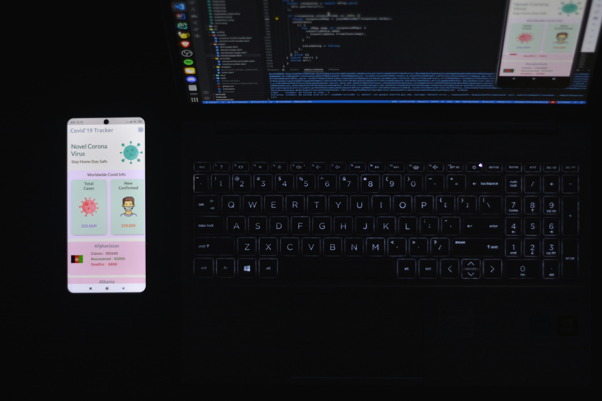

 

<h1 align="center">Ahmed Al-Botini</h1>

<h3 align="center"> Flutter Developer • Android Native • Networking </h3>

       

---

## 👨‍💻 About Me

I'm an IT graduate / junior software developer focused on building practical applications with **Flutter and Dart**, while exploring deeper Android, backend, AI, and networking technologies.

I enjoy understanding how things work under the hood and turning technical ideas into real-world applications.

* 📱 Mobile development with **Flutter & Dart**
* 🤖 Exploring **AI, Machine Learning & On-Device AI**
* 🧠 Working with **LiteRT / TensorFlow Lite**
* 🔧 Android Native development with **Kotlin**
* 🌐 Building and consuming **REST APIs**
* 🛠️ Backend development with **PHP & Laravel**
* 🔥 Working with **Firebase**
* 🌐 Interested in **Networking & MikroTik**
* 🐙 Using **Git & GitHub** for version control and collaboration
* 🚀 Always learning and building new projects

---

## 🛠️ Technologies & Tools

### 📱 Mobile Development

    

**Experience with:**

* Flutter
* Dart
* Android Native
* Kotlin
* WebView
* MethodChannel
* Foreground Services
* Background Services
* MediaProjection
* Android system APIs

### 🔥 Backend & APIs

    

* PHP
* Laravel
* REST APIs
* JSON
* Firebase Authentication
* Cloud Firestore
* Firebase Realtime Database
* Firebase Storage

### 🤖 AI & Machine Learning

    

* TensorFlow / TensorFlow Lite
* LiteRT
* On-Device AI
* Image Classification
* Object Detection
* YOLO
* MobileNet
* AI API integration
* Google Colab
* Prompt Engineering

### 🌐 Networking

* TCP/IP fundamentals
* DHCP
* DNS
* LAN / WAN
* Wi-Fi
* Network Gateway detection
* MikroTik
* Router status pages
* Network-based Flutter applications

### 🧰 Development Tools

    

---

## 🚀 Featured Projects

### 🛡️ Gohdoo — System-Wide Content Protection

**Flutter + Kotlin + On-Device AI**

A hybrid Flutter/Android application designed to analyze screen content in real time and protect users from inappropriate visual content.

**Technologies:**

* Flutter / Dart
* Kotlin
* MethodChannel
* MediaProjection
* Foreground Service
* Android Overlay
* LiteRT / TensorFlow Lite
* On-Device AI
* Image Processing

The project uses a hybrid architecture where Flutter handles the user interface while native Android handles screen monitoring, system permissions, background processing, and content analysis.

🔗 **Repository:**
https://github.com/ahmedalbotini2/Gohdoo_buler

---

### 📡 Wifo — Network Gateway & Router Access

**Flutter + WebView + Networking**

A Flutter application that detects the local network gateway and provides quick access to the router status page through an embedded WebView.

**Features:**

* Local gateway detection
* Router status page access
* Custom URL support
* Save / open / refresh / delete URL
* Connectivity checks
* Loading and error states

🔗 **Repository:**
https://github.com/ahmedalbotini2/wifo_newtork

---

## 🧠 Currently Learning

I'm continuously expanding my knowledge in:

* Advanced Flutter architecture
* State Management
* Firebase & Cloud Firestore
* Laravel Backend Development
* Android Native integration
* On-Device AI
* LiteRT / TFLite
* Computer Vision
* Networking
* Software Architecture

---

## 📊 GitHub Stats

    

    

---

## 📈 Contribution

    

---

## 🎯 My Goal

> Build useful software, understand the technology behind it, and continuously move from simply writing code to engineering complete solutions.

---

## 🤝 Let's Connect

    

---

   <i>“Keep learning. Keep building. Keep improving.”</i> 

